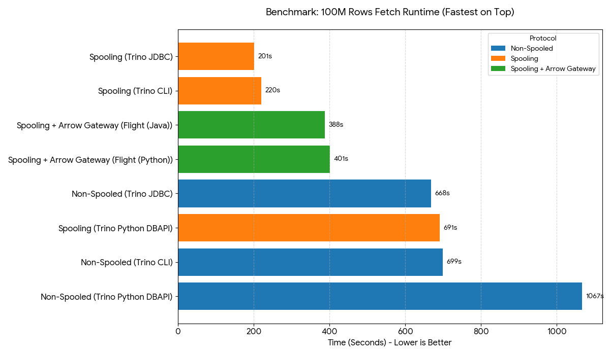

# Trino → Arrow Flight Gateway

Spring Boot service that submits queries to Trino, converts results to Apache Arrow, and serves them over Arrow Flight.

## Benchmarks and expectations

> [!IMPORTANT]
> **Project Context:** Trino does not currently support sending query results in Apache Arrow format. This repository serves as a benchmark
> for a **JSON-to-Arrow gateway/converter** to measure potential throughput gains. Native Arrow support is on the Trino Roadmap and once delivered, 
> the workarounds in this repo will be considered obsolete.



* Trino JDBC with the Spooling Protocol is the top performer, followed closely by the Trino CLI.
* Trino Spooling Protocol is effectively **3x faster** than their non-spooled counterparts.
* Trino Python DB-API is **3x slower** than Java equivalents under the same spooling conditions.
* Trino Python DB-API with spooling can have high RAM usage and may **OOM, leaving queries abandoned** or never finishing.
* Trino-arrow-gateway provides performance boost **only for python users** bringing them closer to java level performance.
* Trino-arrow-gateway is **slower than JDBC** with active spooling because it adds an extra hop and a JSON → Arrow conversion step that JDBC doesn’t need. JDBC fetches/acks spooled segments efficiently.
* Arrow only helps if the producer is already columnar (no JSON→Arrow conversion). **Significant additional gains are expected only with native Arrow support in Trino**.

See more benchmark details in [Benchmark Details](./benchmark/README.md).

## Features

- REST/Flight gateway for Trino query results.
- Arrow conversion pipeline with configurable parallelism.
- Health/actuator endpoints via Spring Boot.

## Requirements
- JDK 25+
- Python 3 with `pyarrow` (only for the sample client)
- Access to Trino with spooling enabled (see below)

## Quick start

```bash
./gradlew bootRun
# server starts on port 8081 by default
```

### Configuration

Main options live in `src/main/resources/application.yml`:
```yaml
server:
  port: 8081
gateway:
  trino:
    base-url: http://localhost:8080
    user: trino-arrow-gateway
    # Sets the request header `X-Trino-Query-Data-Encoding` on /v1/statement.
    # Use `json+zstd` (recommended) or `json`.
    query-data-encoding: json+zstd
  conversion:
    # Thread pool size used for spooled segment download/decode/convert work.
    parallelism: 8
    # Rows per Arrow record batch sent via Flight (per `listener.putNext()`).
    # batch-size: 1024
    # Limit how many segments are processed concurrently (defaults to `parallelism`).
    # max-in-flight-segments: 8
    # Limit how many Arrow batches are buffered per segment while streaming.
    # max-buffered-batches-per-segment: 4
```
Override via environment variables or a custom `application.yml` on the classpath.

## Trino spooling expectations

This gateway relies on Trino returning *spooled* results via `/v1/statement` polling:

- When spooling is enabled, Trino responses include a `data` object with:
  - `encoding`: `json` or `json+zstd`
  - `segments[]`: one of:
    - `type: spooled`: has a downloadable `uri` and an `ackUri`
    - `type: inline`: has base64-encoded `data` (no download/ack)
- For `type: spooled`, the gateway downloads `segments[].uri` and then calls `GET segments[].ackUri` (expects HTTP 200).
  The ack request is required to allow Trino to delete the spooled segment.
- For `type: inline`, the gateway decodes `segments[].data` and streams it like a normal segment.
- Segment payload is expected to be JSON array-of-rows: `[[col1, col2, ...], ...]` (matching Trino column order).

If Trino does not return `data.segments[]`, the Flight request fails (there is no fallback to top-level inline `data: [[...]]`).

## Arrow Flight demo

Start the app, then run the example client:
```bash
cd benchmark
python -m venv .venv
source .venv/bin/activate
pip install -r requirements.txt
python flight_client_test.py
```
This connects to `grpc+tcp://localhost:31337`, requests a demo query, and prints the Arrow table.

### Flight host/port

The Flight server binds and advertises its address via `gateway.flight.*`:
```yaml
gateway:
  flight:
    enabled: true
    bind-host: 0.0.0.0
    advertise-host: localhost
    port: 31337
```
Clients should connect to `grpc+tcp://<advertise-host>:<port>`.

## Building & testing

```bash
./gradlew test
```

## Local testing: Trino spooling + MinIO (Docker)

This repo includes a local Trino + MinIO setup that enables the Trino spooling protocol and stores segments in an S3-compatible filesystem (MinIO).

1) Add a host entry to `/etc/hosts` so the host machine can resolve the MinIO TLS certificate name.
   This is required because Trino spooling uses server-side encryption with customer-provided keys (SSE-C), which requires TLS;
   the included MinIO TLS cert is issued for `minio.local`, so hostname validation must succeed:
```text
127.0.0.1       minio.local
```

2) Start Trino + MinIO:
```bash
docker compose -f docker/docker-compose.yml up
```

3) Start the gateway with the MinIO truststore (so it can download `segments[].uri` over HTTPS):
```bash
JAVA_TOOL_OPTIONS="-Djavax.net.ssl.trustStore=$(pwd)/docker/trino/dev-only-truststore.jks -Djavax.net.ssl.trustStorePassword=changeit" ./gradlew bootRun
```

4) Run a query via the Python Flight client:
```bash
python benchmark/flight_client_test.py "SELECT * FROM tpch.sf1.orders LIMIT 100000"
```

## Performance tuning

If you see low CPU utilization and slow end-to-end `do_get + read_all`, the gateway is often blocked by backpressure (gRPC send speed / client consumption)
and/or too little buffering between “segment conversion” and “Flight streaming”.

Tuning knobs (all under `gateway.conversion.*`):

- `max-buffered-batches-per-segment`: increase this first to keep segment workers busy (trades memory for throughput).
- `max-in-flight-segments`: increase to overlap download/decode/parse across more segments (also increases memory/CPU/network pressure).
- `parallelism`: upper bound for conversion executor threads; set at least as high as `max-in-flight-segments`.
- `batch-size`: affects batch granularity and overhead; larger batches reduce per-batch overhead but increase latency/memory.

Suggested starting point for local testing on an 8-core/16-thread machine:
```yaml
gateway:
  trino:
    query-data-encoding: json+zstd
  conversion:
    parallelism: 16
    max-in-flight-segments: 16
    max-buffered-batches-per-segment: 64
```
If memory/GC becomes an issue, lower `max-buffered-batches-per-segment` first, then `max-in-flight-segments`.

## Publishing coordinates

Artifacts use the group ID `io.github.koszti.trinoarrowgateway`, e.g.:
```
io.github.koszti.trinoarrowgateway:trino-arrow-gateway:<version>
```
